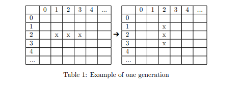

# Bacteria

Attempt done using scala framework.

### Usage

This is a normal sbt project. You can compile code with `sbt compile`, run it with `sbt run`, and `sbt console` will start a Scala 3 REPL.

For more information on the sbt-dotty plugin, see the
[scala3-example-project](https://github.com/scala/scala3-example-project/blob/main/README.md).


## 1 Introduction and Task

Build a simulation of a 2-dimensional grid petri dish of bacteria. While this exercise may appear similar to programming problems you have seen before please
read carefully the instructions including test cases before attempting your solution. The bacteria in dish live and die by the following rules based on the
bacteria surrounding it:

1. Any live bacteria cell with fewer than two live neighbours dies, as if caused
by under-population
2. Any live bacteria cell with two or three live neighbours lives on to the next
generation.
3. Any live bacteria cell with more than three live neighbours dies, as if by
overcrowding.
4. Any dead bacteria cell with exactly three live neighbours becomes a live
bacteria cell, as if by reproduction.



In table 1 if the starting step for the petri dish is the grid on the left the grid on the right would be the petri dish after one generation. You are free to choose any of the following programming language Java, Scala, JavaScript or
TypeScript to implement your solution.


The the program will take from standard input a series of comma separated
integer x,y pairs each on a new line that indicate the location of live bacteria
cells. The input will be terminated with end. Output the results of your simulation to standard output consisting the of x,y pairs marking the locations
of live bacteria cells after one generation has completed, terminate your output
with end. The output of your program should be able to be used to feed into
your program again to perform another “generation”.

## Test Cases
Below is sample input and output to help you with your testing and confirm
you are on the right track. Note that the sort order of the output from your
program need not match the examples below as long as the correct points are
included and the results are terminated with end.


### Sample Input
```
1,2
2,2
3,2
1000000001,1000000002
1000000002,1000000002
1000000003,1000000002
end
```

### Sample output
```
2,1
2,2
2,3
1000000002,1000000001
1000000002,1000000002
1000000002,1000000003
end
```